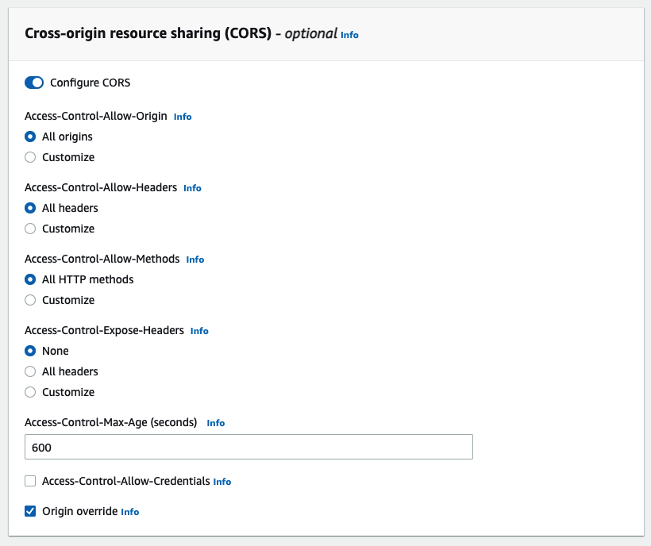

### CloudFront + S3 cors配置

#### 适用场景
Web端通过ajax从CloudFront + S3拉取静态资源

#### 异常现象
* curl -H "origin: example.com" -i http://xxxxxx.cloudfront.net/xxx.json 能够正常返回`access-control-allow-origin:*`，通过jquery get提示跨域错误

#### 配置方式

* CloudFront缓存策略配置 + S3 CORS配置
  * S3 CORS配置 https://docs.aws.amazon.com/AmazonS3/latest/userguide/ManageCorsUsing.html#cors-example-1
  * CloudFront配置 https://aws.amazon.com/cn/premiumsupport/knowledge-center/no-access-control-allow-origin-error/

* CloudFront Reponse headers
  * CloudFront配置 https://aws.amazon.com/cn/premiumsupport/knowledge-center/no-access-control-allow-origin-error/
  * CloudFront reponse headers
   

* CloudFront Function 绑定viewer response直接加标头
  * https://github.com/aws-samples/amazon-cloudfront-functions/blob/main/add-cors-header/index.js