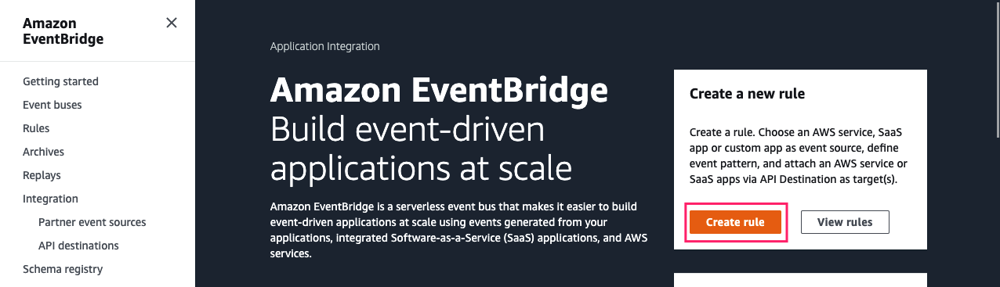
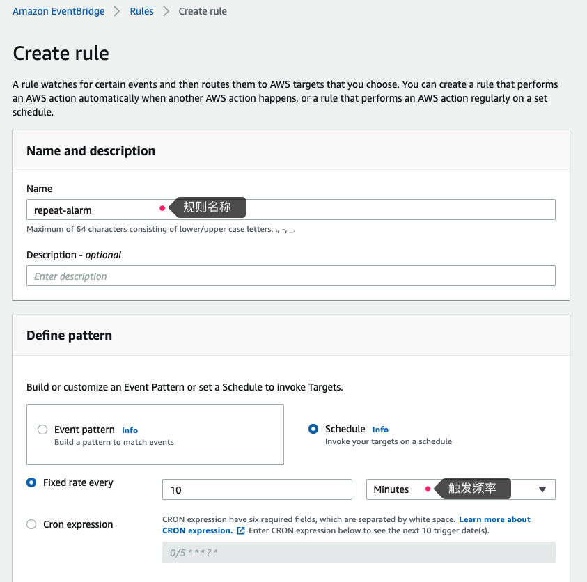
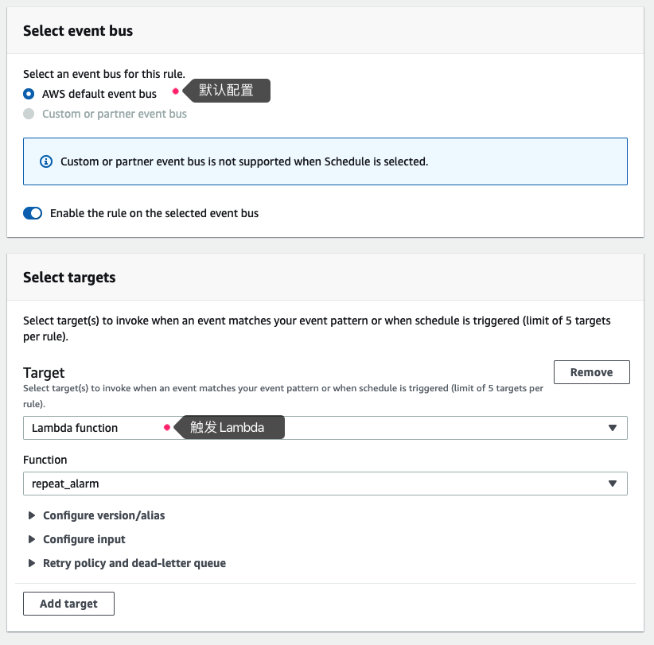

### 配置Cloudwatch持续（重复）发送告警

#### 实现原理

Event Bridge按指定频率触发Lambda，Lambda查找指定的告警所处的状态，若处于“ALARM”（告警中）状态，则再次将告警信息推送至SNS主题。

#### 配置方式

1. 从[这里](./scripts/lambda_resend_alarm.py)复制代码，创建Lambda函数

2. 为Lambda函数角色附加如下权限(可根据需要减小权限)
    * CloudWatchFullAccess
    * AmazonSNSFullAccess

3. 为Lambda函数配置如下环境变量
    * target_alarm_list：关注的告警清单，多个以逗号分隔
    * sns_topic_arn：Cloudwatch告警SNS topic arn

4. 配置EventBridge 规则，按指定频率（本例中10分钟一次）触发Lambda函数





样例事件
```json
{
  "AlarmName": "rds cpu high",
  "AlarmArn": "arn:aws:cloudwatch:ap-northeast-1:xxxxxxxxxxxx:alarm:rds cpu high",
  "AlarmDescription": "rds cpu high",
  "AlarmConfigurationUpdatedTimestamp": "2022-01-17 05:50:20 UTC",
  "ActionsEnabled": true,
  "OKActions": [],
  "AlarmActions": [
    "arn:aws:sns:ap-northeast-1:xxxxxxxxxxxx:Default_CloudWatch_Alarms_Topic"
  ],
  "InsufficientDataActions": [],
  "StateValue": "ALARM",
  "StateReason": "Threshold Crossed: 2 out of the last 2 datapoints [15.398333333333332 (17/01/22 14:42:00), 11.488333333333333 (17/01/22 14:37:00)] were greater than the threshold (10.0) (minimum 2 datapoints for OK -> ALARM transition).",
  "StateReasonData": "{\"version\":\"1.0\",\"queryDate\":\"2022-01-17T14:48:42.271+0000\",\"startDate\":\"2022-01-17T14:37:00.000+0000\",\"statistic\":\"Average\",\"period\":300,\"recentDatapoints\":[11.488333333333333,15.398333333333332],\"threshold\":10.0,\"evaluatedDatapoints\":[{\"timestamp\":\"2022-01-17T14:42:00.000+0000\",\"sampleCount\":5.0,\"value\":15.398333333333332},{\"timestamp\":\"2022-01-17T14:37:00.000+0000\",\"sampleCount\":5.0,\"value\":11.488333333333333}]}",
  "StateUpdatedTimestamp": "2022-01-17 14:48:42 UTC",
  "MetricName": "CPUUtilization",
  "Namespace": "AWS/RDS",
  "Statistic": "Average",
  "Dimensions": [
    {
      "Name": "DBInstanceIdentifier",
      "Value": "database-1-instance-1"
    }
  ],
  "Period": 300,
  "EvaluationPeriods": 2,
  "DatapointsToAlarm": 2,
  "Threshold": 10,
  "ComparisonOperator": "GreaterThanThreshold",
  "TreatMissingData": "missing"
}
```